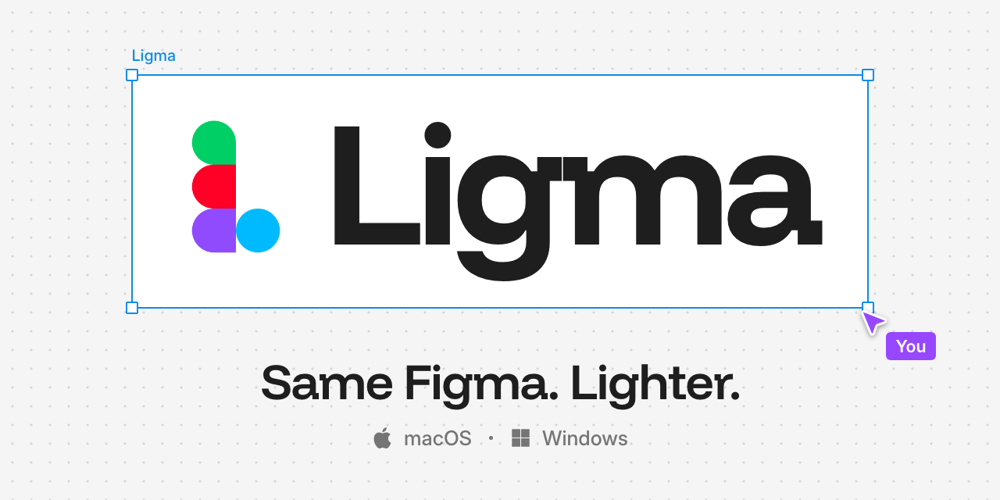
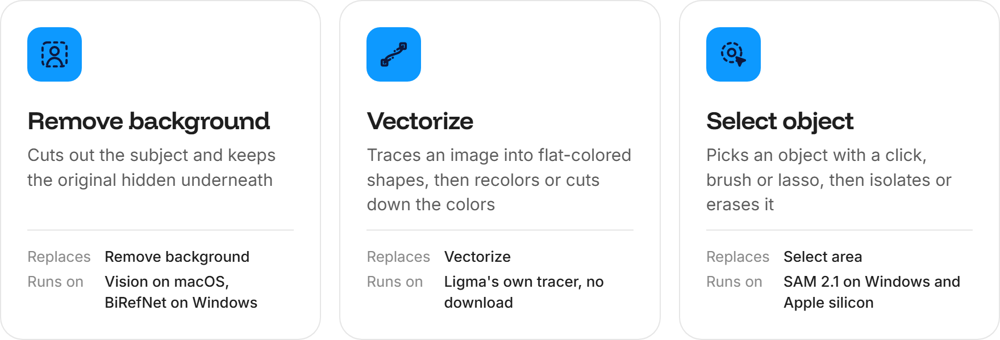

<div align="center">

<a href="https://www.useligma.com/"><picture><source media="(prefers-color-scheme: dark)" srcset="site/social-cover.png"></picture></a>

A lightweight desktop app for [Figma](https://www.figma.com), with far more to work with

<a href="../../releases/latest"><picture><source media="(prefers-color-scheme: dark)" srcset="assets/readme/download-macos-dark.png"></picture></a>&nbsp;&nbsp;<a href="../../releases/latest"><picture><source media="(prefers-color-scheme: dark)" srcset="assets/readme/download-windows-dark.png"></picture></a>

[Website](https://www.useligma.com/) · [Features](docs/FEATURES.md) · [Changelog](CHANGELOG.md) · [Discussions](../../discussions)

</div>

## Why Ligma

Ligma is for people who use Figma all day and want a desktop app that's lighter than the official one. It's built with [Tauri 2](https://tauri.app) and opens `figma.com` in the system webview (WebView2 on Windows, WKWebView on macOS) instead of bundling a browser engine, so it stays small.

<picture><source media="(prefers-color-scheme: dark)" srcset="assets/readme/compare-dark.png"></picture>

Downloads are 7.7 MB on Windows and 8.2 MB on macOS (a universal build for Apple silicon and Intel). See [Memory](docs/MEMORY.md) to compare memory use on your own machine.

## Features

### Tabs and windows

- **Tabs** like the Figma desktop app, with pinning, emoji icons, keyboard shortcuts and your tabs reopened from last time
- **Tab previews** on hover, showing how a tab last looked and whether it's asleep
- **Multiple windows:** drag a tab out of the bar for a window of its own, or onto another window to move it, without reloading
- **Split view:** two files side by side under one set of Figma's panels. Drag a selection from one into the other to move it
- **Files reopen where you left them,** on the same page, position, zoom and mode
- **Low memory use:** tabs you aren't looking at are trimmed, frozen and put to sleep ([details](docs/MEMORY.md))

### Look and feel

- **Nine color themes** in light and dark variants that recolor Figma's interface, never your designs
- **Interface scale** from 50% to 200% for Figma, the tabs and menus together
- **Toolbar modes:** choose which of Draw, Design, Motion and Dev Mode the toolbar's switch offers
- **Lasso fill** under Pencil: draw around an area to fill it with color, as in Procreate
- **Layer previews** in the layers panel in every mode, as Figma shows only in Draw
- **Classic home** keeps Figma's long-standing home page on accounts trying the new one

### Image tools on your computer

In free projects, Figma's AI image actions need a paid plan. Ligma puts its own in the same spots in the image bar. They run on your computer, so your images never leave it.

<picture><source media="(prefers-color-scheme: dark)" srcset="assets/readme/image-tools-dark.png"></picture>

Ligma asks before downloading a model the first time one is needed.

### Design and code

- **Copy as code** to Tailwind and React from the right-click menu, without Dev Mode
- **Image adjustments** copied and pasted between images, without the image itself

### Plugins

- **Plugins in the left sidebar:** your saved and development plugins under Figma's own buttons, one click to run
- **Development plugins** imported from a `manifest.json`, which figma.com doesn't support
- **AI tools in your files** through [Figwright](https://github.com/awdr74100/figwright), without the plugin or Figma's monthly MCP limit

### Everything else

- **Google sign-in** that works like the desktop app's, alongside it or without it
- **Desktop notifications** for comments, mentions and the rest of Figma's bell, which open the file when clicked
- **Discord Rich Presence** showing your file, page and tool, with optional invites to files
- **Local fonts** through Figma's font helper
- **Automatic updates** in the background, without signing you out

See [Features](docs/FEATURES.md) for how each one works and the `settings.json` key behind it.

## Install

Download the latest build from [Releases](../../releases/latest). Builds aren't signed yet, so your system asks once before the first launch. After that, Ligma updates itself.

**macOS** (Apple silicon and Intel): open the `.dmg` and drag Ligma to Applications. The app isn't notarized yet, so run this once in Terminal, or open it anyway from System Settings > Privacy & Security:

```sh
xattr -dr com.apple.quarantine /Applications/Ligma.app
```

**Windows:** run the `-setup.exe` installer. If SmartScreen warns, choose More info > Run anyway.

To report a problem, use **Report…** in Settings (or **Help > Report a Problem…** on macOS). It opens a GitHub issue filled in with your version, system and log.

## Build from source

Needs [Rust](https://rustup.rs) (stable) and Node.js.

```sh
npm install
npm run dev     # debug build, opens the app
npm run build   # release bundle
```

See [Development](docs/DEVELOPMENT.md) for icons, the README graphics and releasing, and [Contributing](CONTRIBUTING.md) before opening a pull request.

## Legal

Ligma is [MIT licensed](LICENSE). It's not affiliated with Figma or Discord.

[Terms of Service](TERMS.md) · [Privacy Policy](PRIVACY.md) · [Security](SECURITY.md) · [Third-party notices](THIRD_PARTY_NOTICES.md)

---

<sub>Created in [T3 Code](https://t3.codes).</sub>
